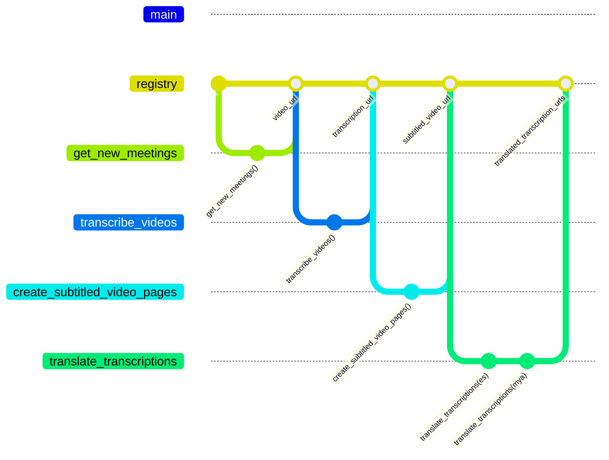

# TGOV Scraper

A set of tools for scraping and analyzing data from the Tulsa Government Access Television (TGOV) website.

## Setup

This project uses Poetry for dependency management.

```bash
# Install dependencies
poetry install --no-root

# Activate the virtual environment
poetry self add poetry-plugin-shell
poetry shell

# Set up pre-commit hooks
poetry run pre-commit install

# Verify pre-commit hooks are working
poetry run pre-commit run --all-files

# See notebook_precommit.md for more details on how notebook outputs are automatically stripped
```

## Running
### Jupyter notebooks

```bash
# Install Jupyter kernel for this environment (needed for Jupyter notebooks)
python -m ipykernel install --user --name=tgov-scraper --display-name="TGOV Scraper"

jupyter notebook
```

### Prefect workflows
We use prefect to organize code into workflows of data tasks.

See https://docs.prefect.io/get-started

```bash
prefect server start                      # to start the persistent server

python -m flows.translate_meetings        # to run a specific flow
```

#### Data "registry" for workflows
The prefect workflows use a "registry" to track meetings and urls to their data artifacts.
E.g., `get_new_meetings` task adds each meeting to the registry with a `video_url`, `transcribe_videos` transcribes the video and adds `transcription_url`, etc.



### Tests

```bash
# Run all tests
pytest

# Run specific tests
pytest tests/test_meetings.py

# Run tests with verbose output
pytest -v
```

## Project Structure

- `data/`: local data artifacts
- `flows/`: prefect flows
- `notebooks/`: Jupyter notebooks for analysis and exploration
- `scripts/`: one off scripts for downloading, conversions, etc
- `src/`: Source code for the scraper
  - `models/`: Pydantic models for data representation
- `tasks/`: prefect tasks
- `tests/`: Test files
- `notebooks/`: Jupyter notebooks for analysis and exploration
- `data/`: output from notebooks


## Running the transcription scripts

### download the mp4
```
poetry run python scripts/download_m3u8.py 'https://archive-stream.granicus.com/OnDemand/_definst_/mp4:archive/tulsa-ok/tulsa-ok_843d30f2-b631-4a16-8018-a2a31930be70.mp4/playlist.m3u8' --output data/video/test_granicus_video.mp4
```
### transcribe
```
poetry run python scripts/video2text.py data/video/test_granicus_video.mp4 --model-size tiny --verbose
```
